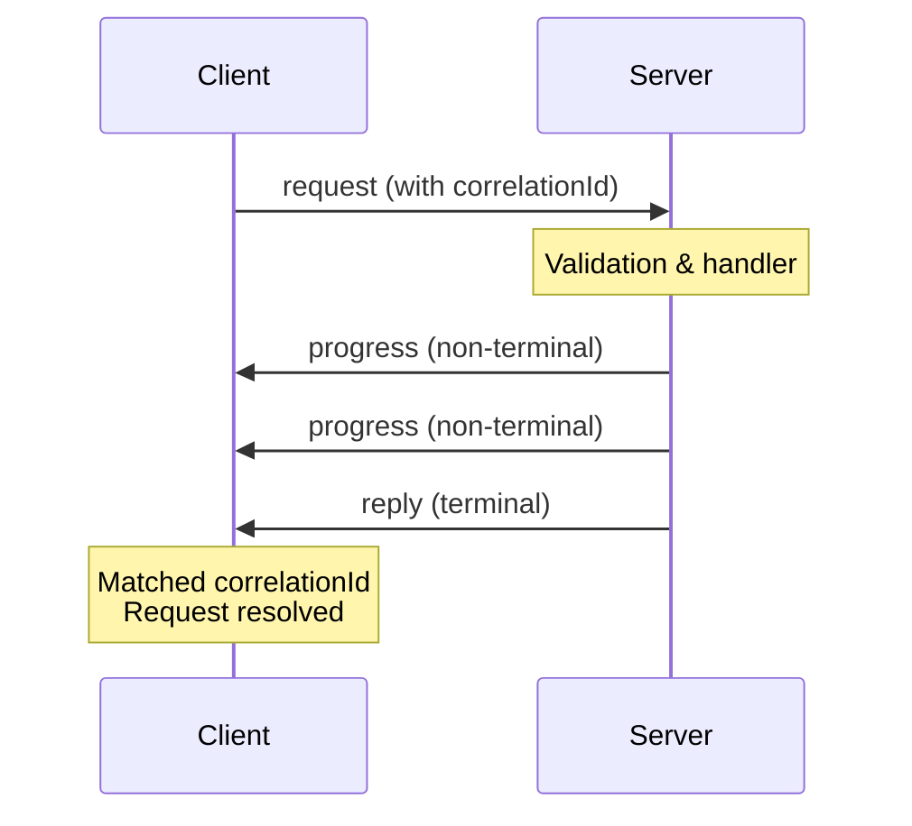

# Request-Response Pattern (RPC) Guide

RPC (Remote Procedure Call) enables type-safe request-response communication with automatic correlation tracking. Unlike fire-and-forget messages, RPC calls wait for a response and handle timeouts, errors, and cancellation.

## Overview

RPC in ws-kit differs from typical messaging:

- **Fire-and-forget** (`on()`, `send()`): Unidirectional, no reply expected
- **Request-response** (`rpc()`, `request()`): Bidirectional, client waits for response

```typescript
// Fire-and-forget: no response
router.on(UserLoggedIn, (ctx) => {
  ctx.publish("notifications", NotifyMessage, { userId: ctx.payload.userId });
});

// Request-response: client waits for response
router.rpc(GetUser, (ctx) => {
  ctx.reply(GetUser.response, { user: await db.findById(ctx.payload.id) });
});
```

**RPC Lifecycle:**



## Server-Side: Defining RPC Handlers

### Basic RPC Handler

Use `router.rpc()` to register a handler that returns a response:

```typescript
import { z, rpc, createRouter } from "@ws-kit/zod";

const GetUser = rpc("GET_USER", { id: z.string() }, "USER_RESPONSE", {
  user: UserSchema,
});

const router = createRouter();

router.rpc(GetUser, async (ctx) => {
  const user = await db.users.findById(ctx.payload.id);

  if (!user) {
    ctx.error("NOT_FOUND", "User not found");
    return;
  }

  // Terminal response - resolves the client's request()
  ctx.reply(GetUser.response, { user });
});
```

The difference from `on()`:

- `ctx.reply()` is available (terminal response, one-shot guarded)
- `ctx.progress()` is available (non-terminal streaming updates)
- `ctx.abortSignal` is available (for client cancellation)
- `ctx.deadline` is available (server-derived deadline from client timeout)

### Progress Updates

Before sending a terminal reply, send progress updates to keep the client informed:

```typescript
const LongOperation = rpc("LONG_OP", { query: z.string() }, "LONG_OP_RESULT", {
  results: z.array(z.unknown()),
  duration: z.number(),
});

router.rpc(LongOperation, async (ctx) => {
  const start = Date.now();

  // Progress: not the final response, client can subscribe to updates
  ctx.progress?.({ stage: "loading", progress: 0 });

  const results = [];
  for (let i = 0; i < 1000; i++) {
    results.push(await processItem(i));

    if (i % 100 === 0) {
      ctx.progress?.({ stage: "processing", progress: (i / 1000) * 100 });
    }
  }

  // Terminal reply: ends the request
  const duration = Date.now() - start;
  ctx.reply(LongOperation.response, { results, duration });
});
```

### Error Handling in RPC

Use `ctx.error()` to reject requests with standard error codes. Clients automatically infer retry behavior and respect backoff hints:

```typescript
router.rpc(GetUser, async (ctx) => {
  // Validation error (non-retryable)
  if (!isValidUserId(ctx.payload.id)) {
    ctx.error("INVALID_ARGUMENT", "Invalid user ID format");
    return;
  }

  // Not found (non-retryable)
  const user = await db.users.findById(ctx.payload.id);
  if (!user) {
    ctx.error("NOT_FOUND", "User not found");
    return;
  }

  // Precondition error (non-retryable)
  if (!user.isActive) {
    ctx.error("FAILED_PRECONDITION", "User account is inactive");
    return;
  }

  ctx.reply(GetUser.response, { user });
});
```

Transient errors with backoff hints:

```typescript
router.rpc(ProcessData, async (ctx) => {
  try {
    const result = await expensiveComputation(ctx.payload);
    ctx.reply(ProcessData.response, { result });
  } catch (err) {
    if (isRateLimited(err)) {
      // Transient error: client will auto-retry with backoff
      ctx.error("RESOURCE_EXHAUSTED", "Server busy", undefined, {
        retryable: true,
        retryAfterMs: 2000, // Client waits 2s before retry
      });
    } else if (isTemporary(err)) {
      // Transient infrastructure error (auto-retryable)
      ctx.error("UNAVAILABLE", "Database temporarily unavailable");
    } else {
      // Unexpected error (don't retry)
      ctx.error("INTERNAL", "Computation failed");
    }
  }
});
```

**Key error codes:**

**Terminal (non-retryable):**

- `INVALID_ARGUMENT`: Input validation failed
- `UNAUTHENTICATED`: Authentication missing or invalid
- `PERMISSION_DENIED`: Authenticated but lacks permissions
- `NOT_FOUND`: Resource doesn't exist
- `FAILED_PRECONDITION`: State requirement not met
- `UNIMPLEMENTED`: Feature not supported

**Transient (automatically retryable):**

- `RESOURCE_EXHAUSTED`: Rate limit or quota exceeded (use `retryAfterMs`)
- `DEADLINE_EXCEEDED`: Request timed out
- `UNAVAILABLE`: Service temporarily unavailable
- `ABORTED`: Concurrency conflict

**Mixed:**

- `INTERNAL`: Unexpected server error (server decides retryability)
- `CANCELLED`: Client cancelled or disconnected

See [Error Handling Spec](../specs/error-handling.md) for the complete taxonomy and retry semantics.

### Cancellation and Deadlines

Handle client cancellation using `ctx.abortSignal`:

```typescript
router.rpc(LongQuery, async (ctx) => {
  const controller = new AbortController();

  try {
    // Pass abort signal to fetch
    const result = await fetch(`/api/query`, {
      signal: ctx.abortSignal || controller.signal,
    }).then((r) => r.json());

    ctx.reply(LongQuery.response, result);
  } catch (err) {
    if (err.name === "AbortError") {
      // Client cancelled or connection closed
      console.log("Request cancelled");
      return;
    }

    ctx.error("INTERNAL", "Query failed");
  }
});
```

Use `ctx.timeRemaining()` to check deadline:

```typescript
router.rpc(GetUser, async (ctx) => {
  // Check time budget before starting expensive work
  if (ctx.timeRemaining() < 1000) {
    ctx.error("DEADLINE_EXCEEDED", "Not enough time to process");
    return;
  }

  const user = await db.users.findById(ctx.payload.id);
  ctx.reply(GetUser.response, { user });
});
```

Use `ctx.onCancel()` to register cleanup callbacks:

```typescript
router.rpc(UploadFile, async (ctx) => {
  const file = await openUploadStream();

  // Clean up if cancelled
  ctx.onCancel?.(() => {
    file.close();
    console.log("Upload cancelled");
  });

  await file.write(ctx.payload.data);
  ctx.reply(UploadFile.response, { success: true });
});
```

## Client-Side: Making RPC Requests

### Basic Request

Use `client.request()` to make RPC calls:

```typescript
import { z, rpc } from "@ws-kit/zod";
import { wsClient } from "@ws-kit/client/zod";

const GetUser = rpc("GET_USER", { id: z.string() }, "USER_RESPONSE", {
  user: UserSchema,
});

const client = wsClient({ url: "ws://localhost:3000" });

try {
  const response = await client.request(GetUser, { id: "123" });
  console.log("User:", response.payload.user);
} catch (err) {
  if (err instanceof TimeoutError) {
    console.warn("Request timed out");
  } else if (err instanceof RpcError) {
    console.error("Server error:", err.code, err.details);
  }
}
```

### Server-Side Progress (Stream Pattern)

The server can send progress updates before the terminal reply. On the client, these are received as separate messages:

```typescript
// Define a message schema for progress updates
const SearchProgress = message("SEARCH_PROGRESS", {
  stage: z.enum(["loading", "processing", "finalizing"]),
  progress: z.number().min(0).max(100),
});

// Client listens for progress updates
client.on(SearchProgress, (msg) => {
  console.log(`Progress: ${msg.payload.stage} ${msg.payload.progress}%`);
});

// Then waits for the RPC response
try {
  const result = await client.request(LongOperation, { query: "search term" });
  console.log("Results:", result.payload.results);
} catch (err) {
  console.error("Failed:", err);
}
```

Note: `client.request()` returns a Promise directly. To receive streaming updates, register a handler with `client.on()` for the progress message type and await the RPC response separately.

### Timeouts and Cancellation

Set a custom timeout and cancel requests:

```typescript
const controller = new AbortController();

// Cancel after 5 seconds
const timeoutId = setTimeout(() => controller.abort(), 5000);

try {
  const response = await client.request(
    GetUser,
    { id: "123" },
    {
      timeoutMs: 30000, // Server timeout
      signal: controller.signal, // Client-side abort
    },
  );
  console.log("User:", response.payload.user);
} catch (err) {
  if (err instanceof TimeoutError) {
    console.warn("Request timed out");
  }
} finally {
  clearTimeout(timeoutId);
}
```

### Error Handling

Handle different error types:

```typescript
import {
  TimeoutError,
  RpcError,
  ValidationError,
  WsDisconnectedError,
} from "@ws-kit/client";

try {
  const response = await client.request(GetUser, { id: "123" });
} catch (err) {
  if (err instanceof TimeoutError) {
    console.warn(`Timeout after ${err.timeoutMs}ms`);
  } else if (err instanceof RpcError) {
    console.error(`RPC error: ${err.code}`);

    // Some errors are retryable with backoff
    if (err.retryable && err.retryAfterMs) {
      console.log(`Retry after ${err.retryAfterMs}ms`);
    }
  } else if (err instanceof ValidationError) {
    console.error("Invalid response from server");
  } else if (err instanceof WsDisconnectedError) {
    console.warn("Connection lost during request");
  }
}
```

## Common Patterns

### Request-Reply with Data Validation

Validate responses on the client:

```typescript
const response = await client.request(GetUser, { id: "123" });

// Response is already validated against UserSchema
// TypeScript knows the structure
if (response.payload.user.email.includes("@")) {
  console.log("Valid email");
}
```

### Idempotent Operations

For idempotent operations, include a correlation ID:

```typescript
const correlationId = crypto.randomUUID();

const response = await client.request(
  CreateUser,
  { name: "Alice", email: "alice@example.com" },
  {
    correlationId, // Server can use this for deduplication
  },
);
```

### Chained Requests

Chain multiple RPC calls:

```typescript
try {
  // First request
  const userResponse = await client.request(GetUser, { id: "123" });
  const userId = userResponse.payload.user.id;

  // Second request (depends on first)
  const ordersResponse = await client.request(GetUserOrders, { userId });

  console.log("Orders:", ordersResponse.payload.orders);
} catch (err) {
  console.error("Chain failed:", err);
}
```

### Concurrent Requests

Run multiple RPC calls in parallel:

```typescript
const [userResponse, ordersResponse, statsResponse] = await Promise.all([
  client.request(GetUser, { id: "123" }),
  client.request(GetUserOrders, { userId: "123" }),
  client.request(GetUserStats, { userId: "123" }),
]);

console.log("User:", userResponse.payload.user);
console.log("Orders:", ordersResponse.payload.orders);
console.log("Stats:", statsResponse.payload.stats);
```

### Streaming Large Results

For large responses, use progress updates to stream data in batches:

```typescript
// Define progress message for batch data
const DataBatch = message("DATA_BATCH", {
  items: z.array(z.unknown()),
  offset: z.number(),
  total: z.number(),
});

// Server sends progress updates via ctx.progress(), which client receives as DATA_BATCH messages
router.rpc(StreamLargeData, async (ctx) => {
  const batchSize = 100;
  const total = 10000;

  for (let i = 0; i < total; i += batchSize) {
    const batch = await db.fetchBatch(i, batchSize);

    ctx.progress?.({
      items: batch,
      offset: i,
      total,
    });
  }

  ctx.reply(StreamLargeData.response, { complete: true });
});

// Client listens for batch updates
client.on(DataBatch, (msg) => {
  console.log(`Received ${msg.payload.items.length} items`);
  processItems(msg.payload.items);
});

// Then makes the RPC request and waits for completion
const result = await client.request(StreamLargeData, {});
console.log("Transfer complete");
```

## Comparison: RPC vs Fire-and-Forget

| Aspect           | RPC (`router.rpc()`)         | Fire-and-Forget (`router.on()`)           |
| ---------------- | ---------------------------- | ----------------------------------------- |
| Response         | Required (via `ctx.reply()`) | None (via `ctx.send()` / `ctx.publish()`) |
| Client waiting   | Yes, promises resolve        | No, fire-and-forget                       |
| Timeout          | Yes (server-derived)         | N/A                                       |
| Correlation      | Automatic                    | Manual (via metadata)                     |
| One-shot reply   | Guaranteed                   | N/A                                       |
| Progress updates | Yes (`ctx.progress()`)       | N/A                                       |
| Use case         | Query, command with response | Event, notification, broadcast            |

Choose RPC when:

- Client needs a response
- You want automatic correlation
- Operation might timeout
- Progress updates are valuable

Choose fire-and-forget when:

- No response needed
- Publishing to multiple clients
- Pure event notification

## Architecture Decisions

For design rationale, alternatives considered, and implementation details, see:

- [ADR-012: RPC Minimal, Reliable](../adr/012-rpc-minimal-reliable.md)
- [ADR-013: RPC Reconnect & Idempotency](../adr/013-rpc-reconnect-idempotency.md)
- [ADR-014: RPC DX & Safety Improvements](../adr/014-rpc-dx-safety-improvements.md)
- [ADR-015: Unified RPC API Design](../adr/015-unified-rpc-api-design.md)

## Troubleshooting

See the [RPC Troubleshooting Guide](./rpc-troubleshooting.md) for solutions to common issues.
