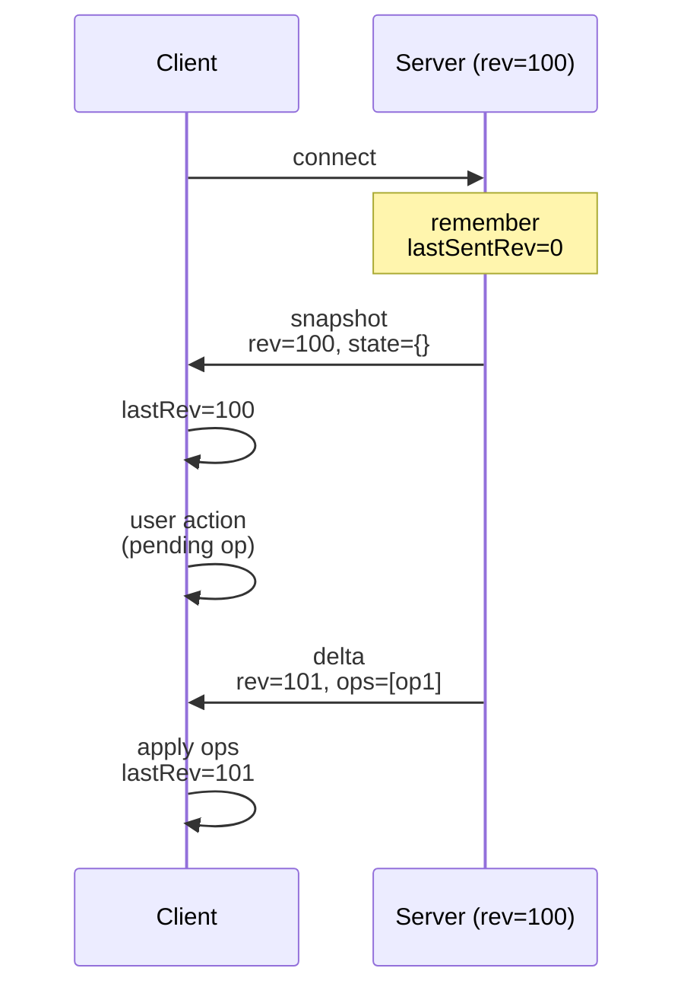
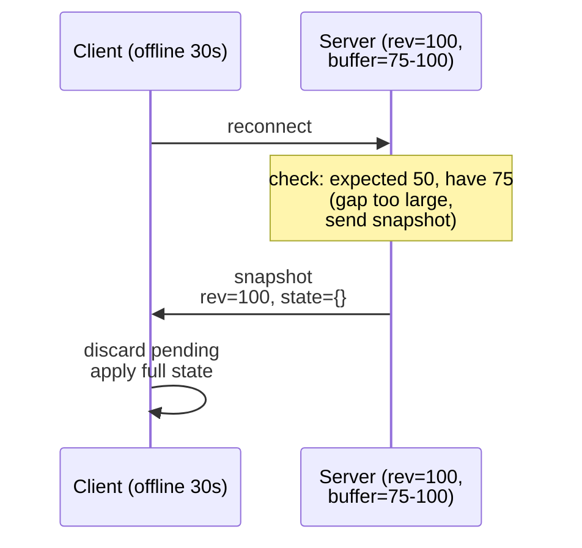

# Delta Sync Application Pattern

Efficient bandwidth via operation deltas with fallback snapshots for state synchronization.

**Spec-Version:** 1.0.0 | **Invariants:** [docs/invariants.md](../invariants.md)

## Overview

Delta sync sends only state changes (deltas) instead of full state on each update. This reduces bandwidth significantly in collaborative and real-time applications, especially with many concurrent users or large state objects.

## Architecture

**Server state:**

1. Maintain global revision counter (incremented per operation)
2. Store operation history in ring buffer (e.g., last 1024 operations)
3. Keep current state snapshot for far-behind clients
4. Track each client's `lastSentRev` (last revision sent to that client)

**Client state:**

1. Track `serverRev` (last received revision from server)
2. Maintain pending operations (optimistically applied locally)
3. Merge incoming deltas and snapshots into materialized view

## Server MUST

1. Increment global revision counter on every state change
2. Store each operation with its revision in a ring buffer
3. For each client, compute delta (operations since `lastSentRev`)
4. If delta is unavailable (client too far behind), send full snapshot instead
5. Include revision metadata in state messages: `rev` for snapshots, `fromRev`/`toRev` for deltas
6. Track per-client `lastSentRev` to compute deltas correctly

## Client MUST

1. Track `serverRev` from received messages
2. Apply incoming deltas in order (maintain FIFO)
3. Fall back to full refresh if `SNAPSHOT` received instead of deltas
4. Implement optimistic updates (apply pending ops before server confirmation)
5. Rebase pending operations after conflict resolution

## Recovery Strategy

When a client falls too far behind (revision gap exceeds buffer size), the server:

1. Sends a `REVISION_GAP` error message with metadata about the gap
2. Then sends a **full snapshot** for recovery

The client discards pending operations and applies the snapshot, then resumes delta sync on subsequent updates.

```text
Client (offline 30s)     Server (rev=100, buffer=75-100)

    reconnect            >
                             check: expected 50, have 75
                             (gap too large, send error + snapshot)
    <   REVISION_GAP      $ expectedRev=50, serverRev=100, bufferFirstRev=75
    <   snapshot         $ rev=100, state={}
    discard pending      $
    apply full state     $
    resume delta sync    $
```

## Timelines

**Happy path (delta sync):**



**Far-behind recovery (snapshot fallback):**



## Failure Modes

| Condition                            | Error             | Retryable | Client Action                                                                        |
| ------------------------------------ | ----------------- | --------- | ------------------------------------------------------------------------------------ |
| Client far behind (rev gap > buffer) | `REVISION_GAP`    | yes       | Receive `REVISION_GAP` metadata, then accept `SYNC.SNAPSHOT` and discard pending ops |
| Concurrent client updates            | (via deltas)      | n/a       | Apply deltas in order, rebase pending ops, ack confirmed ops via `clientReqId`       |
| Unauthorized update                  | `UNAUTHENTICATED` | no        | Reconnect with valid credentials and rejoin                                          |

## Key Implementation Details

1. **Ring Buffer** — Fixed-size circular buffer prevents unbounded memory growth
2. **Revision Tracking** — Allows efficient delta computation without full state copies
3. **Per-Client State** — Each client has independent `lastSentRev` for personalized deltas
4. **Optimistic Updates** — Apply pending ops locally before server confirmation
5. **Fallback Strategy** — Send snapshots when buffer doesn't have enough history

## Conformance

Delta sync ships with three fixtures validating core scenarios:

1. **001-happy-path** — Client joins, receives snapshot, then receives deltas on updates
2. **002-revision-gap** — Client falls behind buffer, receives `REVISION_GAP` error + snapshot
3. **003-optimistic-update** — Client sends update, receives server confirmation via `clientReqId`

Run conformance tests with:

```bash
bun test examples/delta-sync/conformance.test.ts
```

## Limitations

- No persistence layer; in-memory ring buffer only
- No automatic backpressure; assumes clients handle snapshots gracefully
- No encryption; suitable for trusted networks only
