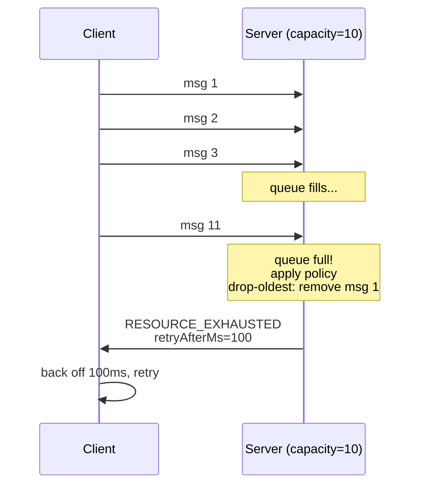
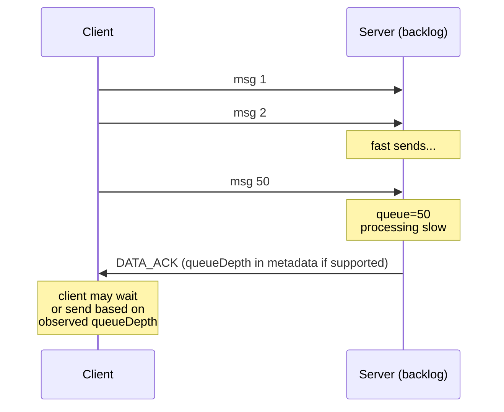

# Flow Control Application Pattern

Backpressure strategies (drop-oldest, drop-new, queue) with server retry hints.

**Spec-Version:** 1.0.0 | **Schema:** `examples/flow-control/contract.json`
**Fixtures:** `examples/flow-control/fixtures/` | **Tests:** `conformance.test.ts`
**Invariants:** [docs/invariants.md](../invariants.md)

## Server MUST

1. Define `policy` (e.g., "drop-oldest", "drop-new", "queue") at router startup
2. For drop policies: on queue overflow, emit `RESOURCE_EXHAUSTED` error with `retryAfterMs` hint
3. Never drop messages silently (drop policies must emit error); queue policy accumulates without bound
4. Track queue depth per client (for monitoring)

## Client MUST

1. On receiving `RESOURCE_EXHAUSTED`, back off by at least `retryAfterMs`
2. Do not queue messages if policy is "drop-new"
3. For policy "queue", monitor `queueDepth` from server signals to gauge backlog

## Failure Modes

| Condition                | Error              | Retryable | Client Action                                              |
| ------------------------ | ------------------ | --------- | ---------------------------------------------------------- |
| Queue full (drop-oldest) | RESOURCE_EXHAUSTED | yes       | back off by `retryAfterMs`                                 |
| Queue full (drop-new)    | RESOURCE_EXHAUSTED | yes       | drop new msg locally, back off                             |
| Queue unbounded (queue)  | (none)             | —         | monitor `queueDepth` from ACKs or errors on other policies |

## Timelines

**Drop policy on overflow:**

**Queue policy (no drop):**

## Conformance

`examples/flow-control/conformance.test.ts` currently verifies:

- Contract and fixture schema versions match
- Fixtures are numbered sequentially
- Fixtures expose the required structural fields (`steps`, `assertions`, etc.)

Fixtures ship at:

1. **001-drop-oldest** — Queue full, policy="drop-oldest", msg 1 discarded, client gets error
2. **002-drop-new** — Queue full, policy="drop-new", new msg dropped, client backs off
3. **003-queue-unlimited** — policy="queue", messages accumulated, no error until recovery
4. **004-retry-hints** — `RESOURCE_EXHAUSTED` includes `retryAfterMs`, client backs off correctly

See [examples/flow-control/fixtures/](../../examples/flow-control/fixtures/) for definitions. Executable replay tests are a future enhancement.
