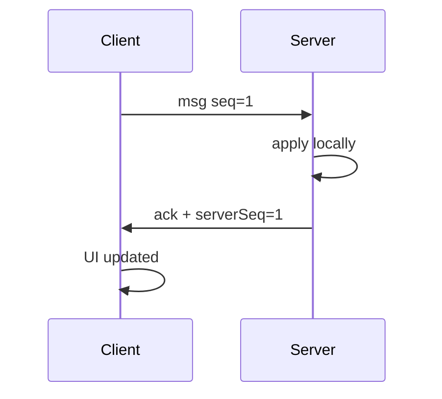
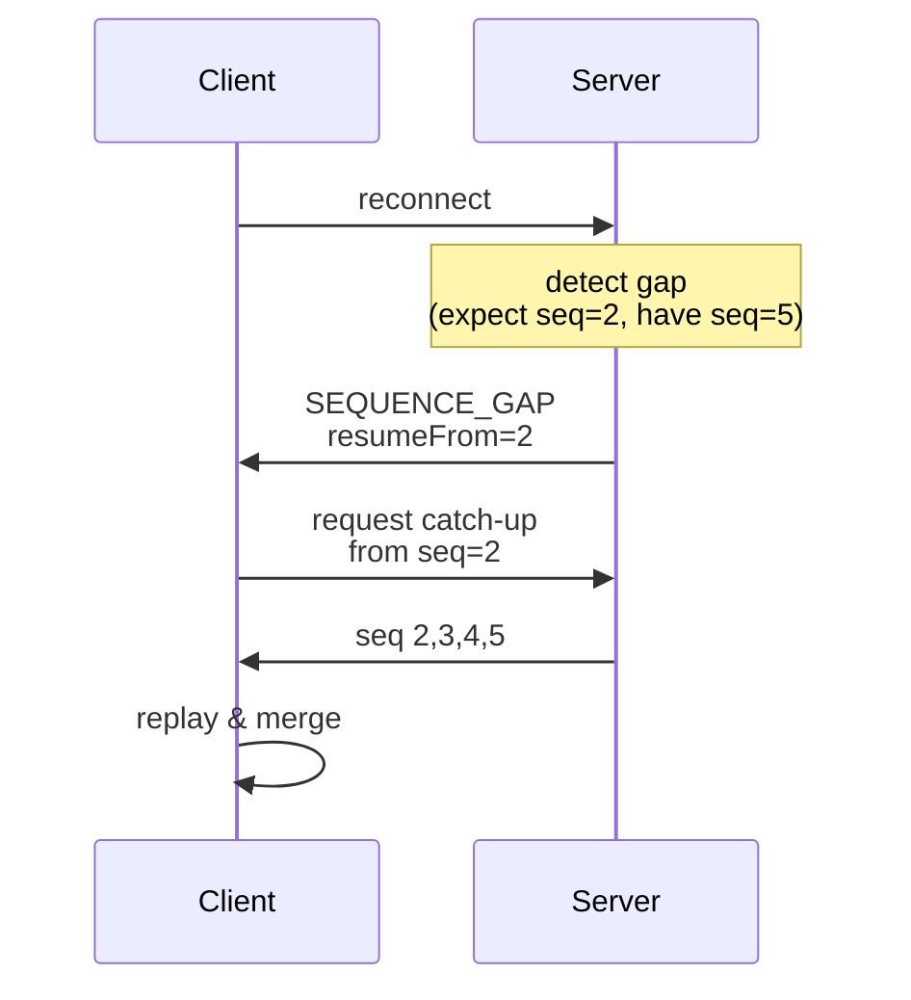

# State Channels Application Pattern

Reliable FIFO state updates with client sequence tracking and recovery from gaps.

**Spec-Version:** 1.0.0 | **Schema:** `examples/state-channels/contract.json`
**Fixtures:** `examples/state-channels/fixtures/` | **Tests:** `conformance.test.ts`
**Invariants:** [docs/invariants.md](../invariants.md)

## Client MUST

1. Tag all messages with `seq` (starting at 1, increment per new message, never on retry)
2. Track `expectedSeq` (next seq expected from server)
3. On receiving a message with seq > expectedSeq, detect gap and request catch-up
4. When `SEQUENCE_GAP` is received, use `resumeFrom` to request history via `CATCH_UP_REQUEST`

## Server MUST

1. Assign `seq` to all outgoing messages (independent counter)
2. Track `lastClientSeq` (last client seq received) and `lastServerSeq` (last server seq sent to this client) per connection
3. If incoming client seq equals last processed seq, silently ack without side effects (idempotent deduplication)
4. On client seq gap detected, send `SEQUENCE_GAP` with:
   - `expectedSeq`: first missing client seq (diagnostic)
   - `receivedSeq`: what client sent
   - `resumeFrom`: first missing server seq = lastServerSeq + 1 (recovery cursor)

## Server SHOULD

1. Manage state history lifecycle—trim old entries or limit memory based on application needs

## Failure Modes

| Condition                             | Error               | Retryable | Client Action                                    |
| ------------------------------------- | ------------------- | --------- | ------------------------------------------------ |
| Client seq gap detected               | SEQUENCE_GAP        | yes       | request catch-up via `resumeFrom` cursor         |
| Duplicate client seq                  | (silent ack)        | yes       | client retries after timeout                     |
| Server seq gap detected (client-side) | (detect on receive) | yes       | send CATCH_UP_REQUEST from current `expectedSeq` |

## Timelines

**Happy path:**

**Gap recovery:**

## Conformance

`examples/state-channels/conformance.test.ts` currently verifies:

- Contract and fixture schema versions match
- Fixtures are numbered sequentially
- Fixtures expose the required structural fields (`steps`, `assertions`, etc.)

Fixtures ship at:

1. **001-initialization** — Client joins, receives seq=0 snapshot
2. **002-gap-detected** — Client offline, reconnects with gap, receives `SEQUENCE_GAP`
3. **003-duplicate-reject** — Client retries seq=5, server silently acks (no side effects)

See [examples/state-channels/fixtures/](../../examples/state-channels/fixtures/) for definitions. Executable replay tests are a future enhancement.
