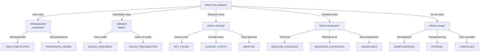

# Error Handling

**Status**: ✅ Implemented ([ADR-015: Unified RPC API Design](../adr/015-unified-rpc-api-design.md#3-expanded-error-taxonomy))

**Architectural Design**: This spec implements the error taxonomy and handling patterns defined in ADR-015 sections 3–4. For design rationale and full taxonomy reference, see [ADR-015](../adr/015-unified-rpc-api-design.md).

**Core Requirements**:

- Use type-safe `ctx.error()` helper with 13 gRPC-aligned error codes
- Provide context in error details (e.g., `{ roomId, userId }`)
- Log errors with `clientId` for traceability
- **By default**, connections stay open on application errors; only specific transport/policy violations auto-close (see [Connection Close Policy](#connection-close-policy) below)
- Unhandled errors trigger `onError` lifecycle hook (if registered in serve options)

**Note**: Error semantics are **identical across all adapters** (Bun, Cloudflare DO, Deno). For adapter-specific behavior, see `docs/specs/adapters.md`.

## Quick Navigation

| Topic                     | Link                                                                                                 |
| ------------------------- | ---------------------------------------------------------------------------------------------------- |
| Send errors from handlers | [Using ctx.error()](#using-ctxerror-recommended)                                                     |
| 13 standard error codes   | [Standard Error Codes](#standard-error-codes)                                                        |
| Complete error taxonomy   | [ADR-015 section 3.3](../adr/015-unified-rpc-api-design.md#33-error-code-reference--decision-matrix) |
| Handling errors in code   | [Error Handling in Handlers](#error-handling-in-handlers)                                            |
| Connection close policy   | [Explicit Connection Close](#explicit-connection-close)                                              |
| Payload & rate limits     | [Limits Monitoring](#limits-monitoring)                                                              |
| Error structure & logging | [Structured Error Objects](#structured-error-objects-for-observability)                              |
| Wire format details       | [Wire Format: ERROR vs RPC_ERROR](#wire-format-error-vs-rpc_error)                                   |

## Error Message Direction {#Error-Message-Direction}

**`ERROR` type messages are server-to-client only.**

Clients MUST NOT send `ERROR` type messages. Use instead:

- **Connection close codes** for transport errors (`ws.close(1011, "reason")`)
- **Application messages** for business errors (e.g., `UPLOAD_FAILED` schema)

**Server behavior**: Inbound `ERROR` messages from clients are undefined. Servers MAY:

- Log and ignore (recommended)
- Close connection with protocol error (`1002`)
- Treat as unhandled message type (if no handler registered)

**Rationale**: Reserving `ERROR` for server responses simplifies protocol semantics and prevents clients from injecting error-handling logic into request/response flows.

**Explicit handler registration**: If server registers `router.on(ErrorMessage, handler)`, it WILL process inbound `ERROR` messages like any other type. This is **not recommended** but allowed for custom protocols.

## Standard Error Schema

```typescript
import { z, message } from "@ws-kit/zod";
// or: import { v, message } from "@ws-kit/valibot";

const ErrorMessage = message("ERROR", {
  code: z.enum([
    // See Standard Error Codes section below for complete taxonomy
    "UNAUTHENTICATED",
    "PERMISSION_DENIED",
    "INVALID_ARGUMENT",
    "FAILED_PRECONDITION",
    "NOT_FOUND",
    "ALREADY_EXISTS",
    "UNIMPLEMENTED",
    "CANCELLED",
    "DEADLINE_EXCEEDED",
    "RESOURCE_EXHAUSTED",
    "UNAVAILABLE",
    "ABORTED",
    "INTERNAL",
  ]),
  message: z.string().optional(),
  details: z.record(z.any()).optional(),
  retryable: z.boolean().optional(),
  retryAfterMs: z.union([z.number().int().nonnegative(), z.null()]).optional(),
});
```

### Wire Format: ERROR vs RPC_ERROR

Two message types carry error information:

- **`ERROR`**: Point-to-point error responses (server → client)
  - No correlation tracking needed
  - Example: validation failure, unhandled exception, limit exceeded

- **`RPC_ERROR`**: RPC-specific errors with correlation tracking
  - Includes `meta.correlationId` for request matching
  - Example: RPC handler failure, RPC timeout
  - If validation fails before correlationId extraction → send `ERROR` instead with code `INVALID_ARGUMENT`

**Unified payload** (both use same structure):

```json
{
  "type": "ERROR" | "RPC_ERROR",
  "meta": {
    "timestamp": 1699123456789,
    "correlationId": "uuid-only-for-RPC_ERROR"
  },
  "payload": {
    "code": "INVALID_ARGUMENT",
    "message": "Email is invalid",
    "details": { "field": "email" },
    "retryable": false,
    "retryAfterMs": null
  }
}
```

## Standard Error Codes {#error-code-enum}

**13 gRPC-aligned error codes** — for complete taxonomy, rationale, and decision tree, see **[ADR-015 section 3.3](../adr/015-unified-rpc-api-design.md#33-error-code-reference--decision-matrix)** (Authoritative Reference).

**Quick Categories**:

- **Authentication/Authorization** (terminal): `UNAUTHENTICATED`, `PERMISSION_DENIED`
- **Input/Validation** (terminal): `INVALID_ARGUMENT`, `FAILED_PRECONDITION`
- **Resource Issues** (mixed): `NOT_FOUND`, `ALREADY_EXISTS` (terminal); `ABORTED` (transient race)
- **Transient Failures**: `DEADLINE_EXCEEDED`, `RESOURCE_EXHAUSTED`, `UNAVAILABLE`
- **Server/Evolution**: `UNIMPLEMENTED`, `INTERNAL`, `CANCELLED`

**Error Code Decision Tree:**



Use `ctx.error(code, message, details)` for type-safe responses. The framework logs all errors with connection identity for traceability.

### Authoritative Error Code Table

See [ADR-015 section 3.3](../adr/015-unified-rpc-api-design.md#33-error-code-reference--decision-matrix) for the complete table with retry semantics, client inference rules, and server validation rules.

### Extending Error Codes

Add domain-specific error codes by using custom string literals with the router and error helpers:

```typescript
// Option 1: Direct string literals with ctx.error()
router.on(CreateRoom, (ctx) => {
  if (!isValidRoomName(ctx.payload.name)) {
    ctx.error("INVALID_ROOM_NAME", "Room name must be 3-50 characters", {
      name: ctx.payload.name,
    });
    return;
  }
});

// Option 2: Type-safe with explicit type annotations (if desired)
type AppErrorCode =
  | ErrorCode
  | "INVALID_ROOM_NAME"
  | "DUPLICATE_USER"
  | "SUBSCRIPTION_EXPIRED";

const sendError = (
  ctx: EventMessageContext,
  code: AppErrorCode,
  message: string,
) => {
  ctx.error(code, message);
};
```

**Important Notes on Custom Codes:**

- WS-Kit accepts custom codes in `WsKitError.from()`, `WsKitError.wrap()`, and `ctx.error()` without modification
- **Standard codes** (13 gRPC-aligned) get built-in metadata: retryability inference, backoff hints via `ERROR_CODE_META`
- **Custom codes** do NOT have built-in metadata; clients MUST read `retryable` and `retryAfterMs` fields from the error payload
- Use `isStandardErrorCode(code)` to check if a code is one of the 13 standard codes at runtime (e.g., before lookup in `ERROR_CODE_META`)
- Provide context in `details` (e.g., `{ roomId, field, reason }`)
- Keep error messages human-readable and helpful
- Errors are automatically logged with `clientId` for debugging

**Type Safety Note**: The `ExtErrorCode` type preserves literal types through overloads, enabling both standard and custom codes to compile with proper type narrowing. Do not simplify `WsKitError.from()` or `WsKitError.wrap()` to single generic signatures; the overload structure is intentional.

**Example: Custom Code with Explicit Retryability**

```typescript
import { WsKitError } from "@ws-kit/core";

// Custom code with explicit retry hint
const error = WsKitError.from(
  "RATE_LIMIT_CUSTOM",
  "Request rate limit exceeded",
  { limit: 100, window: "1m" },
  /* retryAfterMs */ 5000, // Explicitly tell clients when to retry
);
```

### Legacy Code Migration

If migrating from earlier WS-Kit versions with non-standard error codes:

| Legacy Code          | Migration Path                                                 | Notes                                                     |
| -------------------- | -------------------------------------------------------------- | --------------------------------------------------------- |
| `INVALID_ARGUMENT`   | `INVALID_ARGUMENT` (no change)                                 | Direct replacement; already aligned with gRPC             |
| `UNAUTHENTICATED`    | `UNAUTHENTICATED` (no auth) or `PERMISSION_DENIED` (no access) | Auth was conflated; now split for clarity                 |
| `RESOURCE_EXHAUSTED` | `RESOURCE_EXHAUSTED` (set `retryAfterMs` when known)           | Broader scope; include backoff hint for rate limiting     |
| `INTERNAL`           | `INTERNAL` (no change)                                         | Shorter name; same semantics; server decides retryability |

Deploy in stages: new code uses modern codes; accept legacy codes in `onError` hooks for backward compatibility until all clients update.

### Backpressure & Cancellation Semantics {#backpressure-cancellation}

Per ADR-015 section 4.2, WS-Kit implements strict semantics for flow control and request cancellation:

**Backpressure Policy** — When output buffer saturates:

- **Progress updates** (non-terminal): Silently dropped if backpressured; client may miss intermediate states
- **Terminal replies** (RPC responses): Prioritized; never dropped; sends `RESOURCE_EXHAUSTED` if truly impossible
- **Error messages**: Sent immediately; never dropped

**Cancellation Semantics**:

- **Client disconnect** → Server receives `CANCELLED` error; stops processing request
- **Client explicit abort** (`$ws:abort` message) → Handler receives cancel signal via `ctx.abortSignal`; stops processing and returns `CANCELLED` error
- **Server deadline exceeded** → Handler stops; sends `DEADLINE_EXCEEDED` error to client

**Conflict Taxonomy**:

- **`ABORTED`** — Race condition detected (optimistic lock failure, concurrent update)
  - Client action: Retry with backoff after fetching fresh state
  - Example: Two clients update same record; second sees version mismatch
- **`ALREADY_EXISTS`** — Idempotency key replay or uniqueness constraint violation
  - Client action: Use cached result if operation was already applied; or choose new key
  - Example: Client retransmits request with same email; uniqueness constraint fails

**Version Skew Handling**:

- Unknown RPC method or feature behind flag → Send `UNIMPLEMENTED` (not `NOT_FOUND`)
- Allows clients to detect deprecated endpoints and version-gate UI gracefully

## Reserved Control Message Namespace {#control-namespace}

The `$ws:` prefix is **reserved** for system messages sent by ws-kit. Do not use this prefix in your application message types.

**System Control Messages:**

- `$ws:rpc-progress` — Non-terminal RPC progress updates (used internally by `ctx.progress()`)
- `$ws:abort` — RPC cancellation request (client-initiated, used internally by AbortSignal support)

Future system messages may use this namespace, so applications must avoid colliding with names like:

- `$ws:cancel`
- `$ws:ping`
- `$ws:pong`
- `$ws:keepalive`

**Example (do NOT register handlers for):**

```typescript
// ❌ Avoid this
router.on({ type: "$ws:custom-message" }, (ctx) => {
  // This will conflict with future system messages
});

// ✅ Use your own prefix instead
router.on({ type: "APP:custom-message" }, (ctx) => {
  // This is safe and explicit
});
```

## Sending Errors

### Using ctx.error() (Recommended)

Use the `ctx.error()` helper for type-safe error sending:

```typescript
router.on(JoinRoom, (ctx) => {
  const { roomId } = ctx.payload;

  if (!roomExists(roomId)) {
    // ✅ Type-safe: code is validated against ErrorCode enum
    ctx.error("NOT_FOUND", `Room ${roomId} does not exist`, {
      roomId,
    });
    return;
  }

  // Continue with normal flow
});
```

**Note**: Error messages include a producer `meta.timestamp`; **never** base server actions on it — use `ctx.receivedAt` for server logic (see docs/specs/schema.md#Which-timestamp-to-use).

### Backoff Hints with retryAfterMs

Use `retryAfterMs` to provide clients with deterministic retry timing:

**When operation is retryable after waiting**:

```typescript
router.rpc(QueryData, async (ctx) => {
  // Rate limit allows retry after cooldown
  if (isRateLimited(ctx.data.userId)) {
    const retryMs = getRetryDelay(ctx.data.userId);
    ctx.error("RESOURCE_EXHAUSTED", "Rate limited, please retry", undefined, {
      retryable: true,
      retryAfterMs: retryMs, // e.g., 1250
    });
    return;
  }
  // ... proceed
});
```

**When operation is impossible under policy**:

Use `retryAfterMs: null` to signal that the operation cannot be retried under the current policy (e.g., operation cost exceeds rate limit capacity):

```typescript
router.rpc(ExpensiveQuery, async (ctx) => {
  const cost = calculateOperationCost(ctx.payload);
  const capacity = getRateLimitCapacity(ctx.data.userId);

  // Operation cost exceeds capacity; impossible under policy
  if (cost > capacity) {
    ctx.error(
      "RESOURCE_EXHAUSTED",
      "Operation cost exceeds rate limit capacity",
      {
        cost,
        capacity,
      },
      {
        retryable: false,
        retryAfterMs: null, // Signals: don't retry this operation; suggests contacting admin
      },
    );
    return;
  }
  // ... proceed
});
```

Clients receiving `retryAfterMs: null` should NOT retry the operation and instead suggest contacting server admin or using a different approach.

### Error Detail Sanitization

Error details are automatically sanitized before transmission to prevent accidental credential leaks.

**Forbidden keys (case-insensitive)**: `password`, `token`, `authorization`, `bearer`, `jwt`, `apikey`, `api_key`, `accesstoken`, `access_token`, `refreshtoken`, `refresh_token`, `cookie`, `secret`, `credentials`, `auth`

**Size limits**: Nested objects and arrays with JSON representation exceeding 500 characters are dropped entirely (never truncated). Primitive strings have no size limit. If all details are stripped, the `details` field is omitted entirely.

**Important**: Sanitization is a **safety net**, not a substitute for careful design. Always review what you include:

- ✅ Include: Resource IDs, field names, error context
- ❌ Avoid: Passwords, tokens, API keys, internal state

## Error Handling in Handlers

```typescript
router.on(SomeMessage, async (ctx) => {
  try {
    await riskyOperation();
  } catch (error) {
    ctx.error("INTERNAL", "Operation failed", {
      reason: String(error),
    });
    // onError hook will be called with this error
  }
});
```

### Async Error Handling

Unhandled promise rejections in handlers are caught and trigger the `onError` lifecycle hook:

```typescript
router.on(AsyncMessage, async (ctx) => {
  // This error will be caught by the router
  // and onError(error, { type: "ASYNC_MESSAGE", userId: "..." }) will be called
  const result = await unstableAPI();
  ctx.send(AsyncResponse, result);
});
```

### Authentication Middleware (Message Scope)

Per-message authentication checks send `UNAUTHENTICATED` errors and keep the connection open by default:

```typescript
// Default: non-fatal, connection stays open
router.use(ProtectedMessage, (ctx, next) => {
  if (!ctx.data?.userId) {
    ctx.error("UNAUTHENTICATED", "Not authenticated");
    return; // Connection stays open
  }
  return next();
});
```

To enforce strict authentication (close on auth failure), enable the flag during router creation:

```typescript
const router = createRouter({
  auth: {
    closeOnUnauthenticated: true, // Close after sending UNAUTHENTICATED error
    closeOnPermissionDenied: false, // Keep open on permission errors (optional)
  },
});
```

With strict mode enabled, the router will close the connection after sending the error, implementing a stricter policy for your application.

## Explicit Connection Close

Most handlers should **not** close connections. The library automatically closes only in specific cases: handshake scope auth failures, and payload limit violations (with `onExceeded: "close"`). Message-scope auth errors are in-band by default and stay open unless you enable the strict config flags. See [Connection Close Policy](#connection-close-policy) for the complete list.

```typescript
router.use(SendMessage, (ctx, next) => {
  if (isRateLimited(ctx.data?.userId)) {
    // Send error message first
    ctx.error("RESOURCE_EXHAUSTED", "Too many requests");

    // Then close connection if your policy requires it
    ctx.ws.close(1008, "Rate limit exceeded");
    return; // Skip handler
  }
  return next();
});
```

**When to close explicitly:**

- Rate limit violations (once per policy)
- Protocol violations (client repeatedly sends malformed messages)
- Resource exhaustion (client exceeds quota)

**Normal errors** (business logic failures, not found, validation errors) should **not** close the connection.

**Auth failures in message scope** are automatically in-band errors (ERROR messages) unless `auth.closeOnUnauthenticated` or `auth.closeOnPermissionDenied` are enabled.

**Connection Close Codes**:

- `1008` — Policy Violation (rate limit, security policy, auth failure at handshake)
- `1009` — Message Too Big (payload exceeds limit)
- `1011` — Server Error (unexpected server failure)

## Limits Monitoring {#limits-monitoring}

Payload size limits are enforced at the protocol level (before message validation). When a client sends a message exceeding the configured limit, the router:

1. **Calls the `onLimitExceeded` hook** with structured limit information
2. **Sends a `RESOURCE_EXHAUSTED` error** or **closes the connection** (configurable)
3. **Does NOT call `onError`** (limit violations are protocol, not handler errors)

### Configuration

```typescript
import { createRouter } from "@ws-kit/zod";

const router = createRouter({
  limits: {
    maxPayloadBytes: 1_000_000, // 1MB (default)

    // How to respond when limit exceeded
    onExceeded: "send", // Send RESOURCE_EXHAUSTED error (default)
    // "close" — Close with code 1009
    // "custom" — Do nothing (app handles in hook)

    // WebSocket close code when onExceeded === "close"
    closeCode: 1009, // RFC 6455 "Message Too Big" (default)
  },

  hooks: {
    onLimitExceeded: (info) => {
      // info.type = "payload" (extensible for future limits)
      // info.observed = actual payload size (bytes)
      // info.limit = configured limit
      // info.clientId = client identifier
      // info.ws = WebSocket connection

      // Emit metrics/alerts
      metrics.increment("limits.exceeded", {
        type: info.type,
        clientId: info.clientId,
        overage: info.observed - info.limit,
      });
    },
  },
});
```

### Behavior by Mode

| Mode     | Response to Client          | Connection | Hook Called |
| -------- | --------------------------- | ---------- | ----------- |
| `send`   | `ERROR: RESOURCE_EXHAUSTED` | Stays open | ✅          |
| `close`  | None (closes immediately)   | Closes     | ✅          |
| `custom` | None (up to app)            | Stays open | ✅          |

### Payload Limit → RESOURCE_EXHAUSTED Mapping

When `onExceeded: "send"`:

```json
{
  "type": "ERROR",
  "code": "RESOURCE_EXHAUSTED",
  "message": "Payload size exceeds limit (2000001 > 1000000)",
  "details": {
    "observed": 2000001,
    "limit": 1000000
  },
  "retryAfterMs": 0
}
```

Clients should treat `RESOURCE_EXHAUSTED` as transient and may retry with smaller payloads. When `onExceeded: "close"`, the connection closes with code `1009`.

### Rate Limit → RESOURCE_EXHAUSTED or FAILED_PRECONDITION Mapping

Rate limiting via `@ws-kit/middleware` uses the same error handling pipeline as payload limits. When a request exceeds the rate limit:

**Case 1: Retryable (attempted cost ≤ capacity)**:

```json
{
  "type": "ERROR",
  "code": "RESOURCE_EXHAUSTED",
  "message": "Rate limit exceeded",
  "details": {
    "observed": 1,
    "limit": 1
  },
  "retryAfterMs": 1250
}
```

Clients should retry after `retryAfterMs` milliseconds with the same request.

**Case 2: Impossible (attempted cost > capacity)**:

```json
{
  "type": "ERROR",
  "code": "FAILED_PRECONDITION",
  "message": "Operation cost exceeds rate limit capacity (5 > 3)",
  "details": {
    "observed": 5,
    "limit": 3
  }
}
```

Clients should NOT retry this operation under the current policy (cost exceeds capacity). Suggest contacting server admin or using a different approach.

See [guides/rate-limiting.md](../guides/rate-limiting.md) for implementation examples with metrics, alerts, and monitoring integrations.

## Error Behavior

| Error Type       | Connection | Logged | Handler Called    |
| ---------------- | ---------- | ------ | ----------------- |
| Limit exceeded   | Config¹    | ✅     | `onLimitExceeded` |
| Parse error      | Stays open | ✅     | ❌                |
| Missing type     | Stays open | ✅     | ❌                |
| No handler       | Stays open | ✅     | ❌                |
| Validation fails | Stays open | ✅     | ❌                |
| Handler throws   | Stays open | ✅     | `onError`         |
| Async rejection  | Stays open | ✅     | `onError`         |

¹ When `onExceeded: "send"` (default), connection stays open. When `onExceeded: "close"`, connection closes with code 1009.

## Connection Close Policy {#connection-close-policy}

The following table is the **authoritative source** for when WS-Kit closes connections. The default behavior keeps connections open on application errors; only specific transport and policy violations trigger auto-close.

### Policy Table

| Case                         | Scope                                                       | Error Code / Reason                            | Response to Client                            | Connection                                   | Config                                  | Test Reference                                  |
| ---------------------------- | ----------------------------------------------------------- | ---------------------------------------------- | --------------------------------------------- | -------------------------------------------- | --------------------------------------- | ----------------------------------------------- |
| **Handshake auth failure**   | During upgrade or first-message auth guard (before handler) | `UNAUTHENTICATED` or `PERMISSION_DENIED`       | ❌ None (no ERROR frame)                      | 🔴 **Closes immediately** with code **1008** | Automatic                               | `error-handling.test.ts¹`                       |
| **Message-scope auth error** | After connection established (middleware/handler)           | `UNAUTHENTICATED`                              | ✅ `ERROR` message sent                       | 🟢 Stays open (default)                      | `auth.closeOnUnauthenticated` to close  | `error-handling.test.ts²`                       |
| **Message-scope auth error** | After connection established (middleware/handler)           | `PERMISSION_DENIED`                            | ✅ `ERROR` message sent                       | 🟢 Stays open (default)                      | `auth.closeOnPermissionDenied` to close | `error-handling.test.ts³`                       |
| **Payload limit exceeded**   | All scopes                                                  | `RESOURCE_EXHAUSTED` (if `onExceeded: "send"`) | ✅ `ERROR` message sent                       | 🟢 Stays open                                | `onExceeded: "send"` (default)          | `limits.test.ts⁴`                               |
| **Payload limit exceeded**   | All scopes                                                  | (no message)                                   | ❌ None                                       | 🔴 **Closes** with code **1009**             | `onExceeded: "close"`                   | `limits.test.ts⁵`                               |
| **Validation failure**       | All scopes                                                  | `INVALID_ARGUMENT`                             | ✅ `ERROR` message sent                       | 🟢 Stays open                                | —                                       | (default behavior)                              |
| **Handler exception**        | Message handler                                             | `INTERNAL` (or custom)                         | ✅ `ERROR` message sent (if `onError` allows) | 🟢 Stays open                                | —                                       | (use `ctx.ws.close()` to close)                 |
| **All other errors**         | All scopes                                                  | —                                              | ✅ `ERROR` message sent                       | 🟢 Stays open                                | —                                       | (handler must call `ctx.ws.close()` explicitly) |

**¹–⁵ Test References**: These references point to test cases that validate each close behavior. If behavior changes, tests must be updated in parallel to prevent spec-code drift.

### Scope Definitions

- **Handshake scope**: During WebSocket upgrade or first-message auth guards (before app handler runs). Connection not yet logically established.
- **Message scope**: After connection established and initial auth complete. Middleware and message handlers run in this scope.

### Configuration

To enable strict auth failure closure in message scope:

```typescript
const router = createRouter({
  auth: {
    closeOnUnauthenticated: true, // Close after sending UNAUTHENTICATED error
    closeOnPermissionDenied: true, // Close after sending PERMISSION_DENIED error
  },
});
```

To close on payload limit violations:

```typescript
const router = createRouter({
  limits: {
    maxPayloadBytes: 1_000_000,
    onExceeded: "close", // Auto-close on limit violation
    closeCode: 1009, // RFC 6455 "Message Too Big" (default)
  },
});
```

### Rationale

- **Handshake failures** require reconnection with proper credentials/policy; connection is not yet logically established.
- **Message-scope auth errors** are policy violations but can be communicated in-band, allowing graceful client handling or optional closure via config flag.
- **Payload limits** close by default to avoid accepting oversized messages; override with `onExceeded: "send"` if your app can handle them.
- **All other errors** keep connections open, allowing the application to decide when to close via `ctx.ws.close()`.

This design aligns with WebSocket norms and simplifies the mental model: transport/protocol violations trigger auto-close; application errors do not.

## Structured Error Objects for Observability

WsKitError provides standardized error objects for integration with observability tools (ELK, Sentry, DataDog, etc.).

### WsKitError Structure

All errors passed to `onError` handlers are standardized as `WsKitError` objects (extends `Error` with WHATWG `cause` standard):

```typescript
class WsKitError<C extends string = ExtErrorCode> extends Error {
  code: C;                      // One of 13 gRPC-aligned codes or custom code
  message: string;              // Human-readable message
  details: Record<...>;         // Additional context
  retryAfterMs?: number | null; // Backoff hint for transient errors
  correlationId?: string;       // RPC request correlation ID
  cause?: unknown;              // Original error (WHATWG standard)

  // Static methods
  static from<C extends string>(code: C, message: string, ...): WsKitError<C>;
  static wrap<E extends string>(error: WsKitError<E>): WsKitError<E>;
  static wrap<C extends string>(error: unknown, code: C, message?: string, ...): WsKitError<C>;
  static retag<C extends string>(error: unknown, code: C, message?: string, ...): WsKitError<C>;

  // Instance methods
  toJSON(): {...};    // For internal logging (includes cause, stack)
  toPayload(): {...}; // For client transmission (safe, no internals)
}
```

**Type Safety**: Generic type parameter `C` preserves the exact error code type (standard or custom), enabling type narrowing and IDE autocomplete. The overloads for `wrap()` and `retag()` are intentional; do not simplify them into single signatures.

### Error Creation and Transformation

#### `WsKitError.from()` - Create New Error

Creates a new `WsKitError` with the specified code and message:

```typescript
const error = WsKitError.from("INVALID_ARGUMENT", "User ID must be positive", {
  field: "userId",
});
// error.code === "INVALID_ARGUMENT"
// error.cause === undefined (no original error)
```

#### `WsKitError.wrap()` - Preserve or Apply Code

**Without a code**: preserves an existing `WsKitError` unchanged (same instance).
**With a code**: wraps any error (including a `WsKitError`) with the requested code:

```typescript
// Case 1: Preserve existing WsKitError (no new instance created)
const original = WsKitError.from("NOT_FOUND", "User not found");
const preserved = WsKitError.wrap(original);
// preserved === original (same instance)
// preserved.code === "NOT_FOUND" (unchanged)

// Case 2: Wrap non-WsKitError with requested code
const dbError = new Error("Connection timeout");
const wrapped = WsKitError.wrap(dbError, "UNAVAILABLE", "Database unavailable");
// wrapped.code === "UNAVAILABLE"
// wrapped.cause === dbError

// Case 3: Re-wrap WsKitError with different code (preserves original as cause)
const original = WsKitError.from("NOT_FOUND", "User not found");
const retagged = WsKitError.wrap(original, "INTERNAL", "Unexpected error");
// retagged.code === "INTERNAL"
// retagged.cause === original (full error chain preserved)
```

**Use `wrap()`** for safe error handling in try-catch blocks. Provide a code to enforce a specific error type (ideal for standardizing errors from unknown sources). Omit the code to preserve existing WsKitErrors as-is.

#### `WsKitError.retag()` - Change Code

Creates a **new** `WsKitError` with a different code, preserving the input error as `cause`. Useful for mapping domain-specific errors to standard codes:

```typescript
// Case 1: Retag existing WsKitError (creates new instance with original as cause)
const notFound = WsKitError.from("NOT_FOUND", "User not found");
const retagged = WsKitError.retag(notFound, "INTERNAL", "Unexpected error");
// retagged.code === "INTERNAL" (changed)
// retagged.cause === notFound (original preserved for debugging)

// Case 2: Retag non-WsKitError
const err = new Error("User already registered");
const mapped = WsKitError.retag(err, "ALREADY_EXISTS", "Email already in use");
// mapped.code === "ALREADY_EXISTS"
// mapped.cause === err (original error preserved)
```

**Use `retag()`** when you need to map application errors to standard codes while maintaining the full error chain for observability.

### Error Handler Return Value

Return `false` from `onError` to suppress automatic error response:

```typescript
router.onError((error) => {
  logger.error(error); // Log the error
  return false; // Prevent automatic ERROR message to client
});
```

When the handler returns `false` and `autoSendErrorOnThrow` is enabled, the router will NOT send an `INTERNAL` response to the client.
