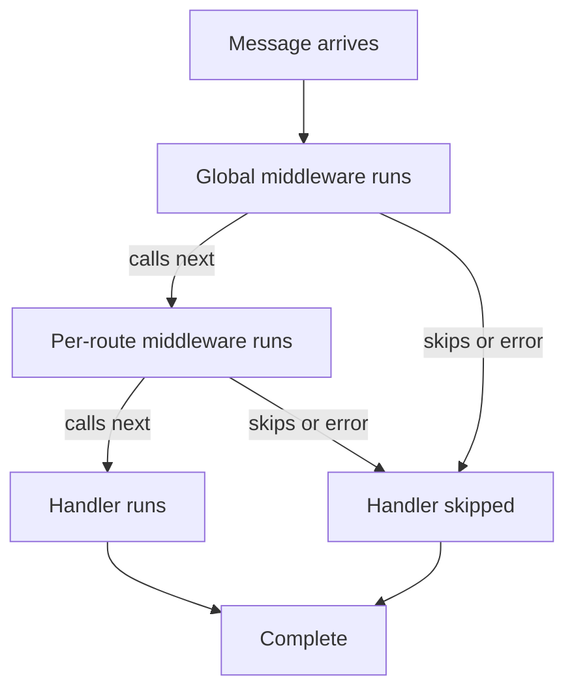

# WebSocket Router Specification

**Status**: ✅ Implemented

## Overview

Type-safe message routing for Bun WebSocket servers with automatic validation.

## Section Map

Quick navigation for AI tools:

- [#Basic-Setup](#basic-setup) — Minimal router example
- [#Router-API](#router-api) — Handler registration, middleware, and context types
- [#Message-Routing](#message-routing) — Type-based dispatch and validation flow
- [#Type-Safe-Sending](#type-safe-sending) — One-way and request/response patterns
- [#Subscriptions-&-Publishing](#subscriptions--publishing) — Type-safe pub/sub with cleanup rules
- [#Custom-Connection-Data](#custom-connection-data) — Typed connection state
- [#Modifying-Connection-Data](#modifying-connection-data) — Update connection data with ctx.assignData()
- [#Error-Handling](#error-handling) — Type-safe errors with ctx.error()
- [#Lifecycle-Hooks](#lifecycle-hooks) — Observability with onOpen, onClose, onError, onBroadcast, onUpgrade

## Basic Setup

**Recommended: Platform-Specific Package** (zero detection overhead)

For a complete quick start example, see the quick start guide in the main README which demonstrates:

- Setting up router with connection data types
- Defining message schemas with full type inference
- Registering handlers with validated payloads
- Starting the server with authentication

This pattern is recommended because:

- ✅ Zero runtime detection overhead
- ✅ Optimal tree-shaking (imports only your target platform)
- ✅ Explicit deployment target (impossible to misconfigure)
- ✅ Single canonical location for platform APIs (validator + platform together)

## Alternative: Low-Level Control

For code that needs direct control over Bun server configuration:

```typescript
import { createBunHandler } from "@ws-kit/bun";

const { fetch, websocket } = createBunHandler(router, {
  authenticate(req) {
    const token = req.headers.get("authorization");
    return token ? { userId: "user-123" } : undefined;
  },
});

Bun.serve({
  port: 3000,
  fetch(req, server) {
    if (new URL(req.url).pathname === "/ws") {
      return fetch(req, server);
    }
    return new Response("Not Found", { status: 404 });
  },
  websocket,
});
```

## Creating a Router

Use `createRouter<TData>()` with an explicit generic for full type safety:

```typescript
import { createRouter } from "@ws-kit/zod";

type AppData = { userId?: string; roles?: string[] };
const router = createRouter<AppData>();
```

**Why explicit?** TypeScript cannot infer connection data types from handler assignments. The explicit generic ensures all handlers and lifecycle callbacks are fully typed:

```typescript
router.on(SomeMessage, (ctx) => {
  // ✅ ctx.ws.data is fully typed as AppData
  const userId = ctx.ws.data.userId; // string | undefined
  const roles = ctx.ws.data.roles; // string[] | undefined
});

router.onClose((ctx) => {
  // ✅ Still correctly typed
  const userId = ctx.ws.data.userId; // string | undefined
});
```

This is a **TypeScript language limitation** (not a design shortcoming). The one-line generic annotation provides complete type safety throughout your application.

### Ambient AppData (Optional: Large Applications)

For large applications with many routers across modules, use TypeScript declaration merging to set a global default and avoid repetition:

```typescript
// types/app-data.d.ts
declare module "@ws-kit/core" {
  interface AppDataDefault {
    userId?: string;
    roles?: string[];
  }
}

// Now createRouter() uses AppDataDefault without repeating the type:
import { createRouter } from "@ws-kit/zod";

const router = createRouter(); // ✅ Automatically uses AppDataDefault
```

This is optional and most useful in large monorepos with shared auth context.

### Structured Logging (Optional)

For production deployments, configure a logger for observability with Winston, Pino, Datadog, or custom integrations:

```typescript
import { createRouter } from "@ws-kit/zod";
import { createLogger, LOG_CONTEXT } from "@ws-kit/core";

// Create custom logger
const logger = createLogger({
  minLevel: "info", // Only log info/warn/error, skip debug
  log: (level, context, message, data) => {
    // Send to logging service (e.g., Datadog, Splunk)
    logService.send({
      level,
      context,
      message,
      ...data,
    });
  },
});

const router = createRouter({
  logger, // Pass to router options
});
```

**Available contexts** (via `LOG_CONTEXT`):

- `CONNECTION` — Connection lifecycle (open, close, errors)
- `HEARTBEAT` — Heartbeat / stale connection detection
- `MESSAGE` — Message routing
- `MIDDLEWARE` — Middleware execution
- `AUTH` — Authentication events
- `VALIDATION` — Schema validation failures
- `ERROR` — Unhandled errors

If not provided, the router logs to console by default. See ADR-011 for design rationale.

### Router Design (Builder Pattern)

The router is implemented as a **plain JavaScript object** that forwards method calls to an internal core router. This transparent builder pattern ensures:

- ✅ **Zero overhead** — Plain object method forwarding, no Proxy traps in production
- ✅ **Type preservation** — Full inference from schema through handlers
- ✅ **Clean stack traces** — No Proxy indirection
- ✅ **Platform agnostic** — Router accepts any platform adapter directly

**In production** (`NODE_ENV === "production"`), the router is always a materialized plain object with zero introspection overhead.

**In development**, an optional Proxy wrapper can provide runtime assertions and typo detection (off by default).

### Advanced: Symbol Escape Hatch

> **⚠️ Use with caution**: This is an internal implementation detail. The public API never requires it.

For advanced introspection (rare; prefer `router.debug()` for most use cases), access the core router via Symbol:

```typescript
const core = (router as any)[Symbol.for("ws-kit.core")];

// Uncommon use cases:
// - Custom meta-programming tooling
// - Advanced middleware inspection
// - Framework integration requiring router internals
```

**Why a Symbol?**

- Follows industry standards (`React.for("react.element")`)
- Signals internal/private API to TypeScript and developers
- Prevents accidental namespace collisions

**When NOT to use:**

- Regular message handling → Use `router.on()`
- Publishing messages → Use `router.publish()`
- Debugging → Use `router.debug()`
- Middleware registration → Use `router.use()`

**When it's appropriate:**

- Building custom tooling that inspects route definitions
- Framework integration requiring low-level metadata access
- Advanced testing utilities with assertions on internal state

### Debug/Assertions

## Development Mode (Optional Proxy Wrapper)

In development (`NODE_ENV !== "production"`), you can enable an optional Proxy wrapper around the router for runtime assertions and typo detection:

```typescript
import { createRouter } from "@ws-kit/zod";

// Enable assertions in development
const router = createRouter<AppData>({
  debug: true, // Opt-in; off by default
});

// The Proxy catches common mistakes:
router.onn(schema, handler); // ❌ Throws: "Did you mean on?"
router.on(schema, handler); // ✅ Works
```

The debug Proxy **is never used in production** — code always uses a plain object with zero overhead. This provides development convenience without impacting performance. Assertions include typo detection for method names, missing handlers, and invalid message type registration. To disable assertions in development, omit `debug: true` or set it to `false`.

### Static Method Calls (Required)

Always use static method calls on the router. Dynamic property access defeats type preservation:

```typescript
// ✅ SAFE: Static method calls
router.on(LoginSchema, handler);
router.use(middleware);

// ❌ UNSAFE: Dynamic property access
const m = "on";
(router as any)[m](schema, handler); // Bypasses type safety
```

## When to Use `on()` vs `rpc()`

Use **`router.on()`** for:

- Fire-and-forget messages (notifications, events, side effects)
- Pub/Sub messaging (publish to topics, broadcast to subscribers)
- One-to-many messaging (one sender, multiple receivers)
- Messages where the sender doesn't need a guaranteed response

Use **`router.rpc()`** (or message schemas with `response` field) for:

- Request/response patterns (client needs to wait for answer)
- Operations that require correlation tracking and timeouts
- Handlers that must reply exactly once (one-shot guarantee)
- Handlers that support progress streaming (non-terminal updates before final reply)

**Rule of thumb**: If your handler uses `ctx.reply()` or `ctx.progress()`, it must be registered with `router.rpc()` or define a message schema with a `response` field. If it only uses `ctx.send()` or `ctx.publish()`, use `router.on()`.

**Example Pattern**:

```typescript
// ✅ Event: fire-and-forget notification
router.on(UserLoggedIn, (ctx) => {
  router.publish("notifications", NotificationMessage, {
    text: `User ${ctx.ws.data?.userId} logged in`,
  });
});

// ✅ RPC: request/response with guaranteed reply
const GetUserResponse = message("GetUserResponse", { user: UserSchema });
const GetUser = rpc(GetUserRequest, GetUserResponse);

router.rpc(GetUser, (ctx) => {
  const user = findUser(ctx.payload.id);
  if (!user) {
    ctx.error?.("NOT_FOUND", "User not found");
    return;
  }
  ctx.reply?.(GetUserResponse, { user }); // Terminal, one-shot reply
});

// ❌ WRONG: Event handler trying to "reply" (no guarantee)
router.on(QueryData, (ctx) => {
  const result = queryDatabase(ctx.payload);
  ctx.send(QueryResponse, result); // Not guaranteed to reach client
});

// ✅ RIGHT: Use RPC for queries that need guaranteed responses
const QueryResponse = message("QueryResponse", { result: z.any() });
const Query = rpc(QueryData, QueryResponse);

router.rpc(Query, (ctx) => {
  const result = queryDatabase(ctx.payload);
  ctx.reply?.(QueryResponse, { result }); // Guaranteed, one-shot reply
});
```

See [ADR-015: Unified RPC API Design](../adr/015-unified-rpc-api-design.md#why-separate-onand-rpc-entry-points) for the design rationale behind this separation.

## Router API

### Message Handlers

```typescript
router.on<Schema extends MessageSchemaType>(
  schema: Schema,
  handler: MessageHandler<Schema, Data>
): WebSocketRouter<Data>
```

**Handler Context**:

```typescript
type MessageContext<Schema, Data> = {
  ws: ServerWebSocket<Data>; // Connection (ws.data.clientId always present)
  type: Schema["shape"]["type"]["value"]; // Message type literal
  meta: z.infer<Schema["shape"]["meta"]>; // Validated client metadata
  payload: z.infer<Schema["shape"]["payload"]>; // Only if schema defines it
  receivedAt: number; // Server receive timestamp (Date.now())

  // All handlers
  send: SendFunction; // Type-safe send to current connection (1-to-1, fire-and-forget)
  error: ErrorFunction; // Type-safe error responses (see ADR-009)
  assignData: AssignDataFunction; // Merge partial data into ctx.ws.data
  topics: {
    subscribe: (topic: string) => Promise<void>; // Subscribe to a topic
    unsubscribe: (topic: string) => Promise<void>; // Unsubscribe from a topic
  };

  // RPC handlers only (when message has response schema)
  reply?: (schema: MessageSchema, data: ResponseType) => void; // Terminal reply, one-shot guarded (ADR-015)
  progress?: (data?: unknown) => void; // Progress update (non-terminal, optional)
  abortSignal?: AbortSignal; // Fires on client cancel/disconnect (ADR-015)
  onCancel?: (cb: () => void) => () => void; // Register cancel callback
  deadline?: number; // Server-derived deadline (epoch ms)
  timeRemaining?: () => number; // ms until deadline
  isRpc?: boolean; // Flag: is this an RPC message?
};
```

**Server-provided context fields**:

- `ctx.ws.data.clientId`: Connection identity (UUID v7, generated during upgrade)
- `ctx.receivedAt`: Server receive timestamp (milliseconds since epoch)
- `ctx.deadline`: Derived from `meta.timeoutMs` (RPC only)
- `ctx.isRpc`: True if message has response schema (see ADR-015)

**RPC-specific methods** (optional; only present when message defines `response` schema):

```typescript
// Terminal reply (one-shot, schema-enforced)
const GetUserResponse = message("GetUserResponse", {
  userId: z.string(),
  email: z.string(),
});
ctx.reply?.(GetUserResponse, { userId: "123", email: "user@example.com" });

// Progress updates before reply (optional)
ctx.progress?.({ loaded: 50 });
ctx.progress?.({ loaded: 100 });
ctx.reply?.(GetUserResponse, { userId: "123", email: "user@example.com" });

// Abort signal for cancellation
const result = await fetch(url, { signal: ctx.abortSignal });

// Cancel callback (alternative to abortSignal)
ctx.onCancel?.(() => {
  console.log("RPC was cancelled");
});
```

See [ADR-015: Unified RPC API](../adr/015-unified-rpc-api-design.md) for design rationale.

### Pre-Validation Context (IngressContext)

Middleware running **before schema validation** (e.g., rate limiting) receive `IngressContext`, which excludes unvalidated payload. See [ADR-021: Adapter-First Architecture](../adr/021-adapter-first-architecture.md) for the adapter pattern.

```typescript
type IngressContext<Data = unknown> = {
  type: string; // Message type (extracted, trusted)
  id: string; // Connection ID (UUID v7)
  ip: string; // Client IP address
  ws: { data: Data }; // App connection state (from authenticate)
  meta: { receivedAt: number }; // Server timestamp (ms)

  send: SendFunction;
  error: ErrorFunction;
  assignData: AssignDataFunction;
  topics: {
    subscribe: (topic: string) => Promise<void>;
    unsubscribe: (topic: string) => Promise<void>;
  };
};
```

**Key differences from `MessageContext`**:

- ❌ `ctx.payload` — not available (schema not validated yet)
- ❌ `ctx.meta.correlationId` — only populated for RPC after routing
- ✅ `ctx.type`, `ctx.ws.data`, `ctx.meta.receivedAt` — all available

## RPC Wire Format (Success and Error)

### RPC Success Response (Option A - Canonical)

When a handler calls `ctx.reply(data)`, the response is sent with the **response message schema type**:

```json
{
  "type": "<ResponseMessageName>",
  "meta": {
    "timestamp": 1730450000123,
    "correlationId": "req-42"
  },
  "payload": {
    /* response fields per schema */
  }
}
```

**Example**: For a `GetUserRequest` → `GetUserResponse` RPC:

```typescript
const GetUserRequest = message("GetUser", { userId: z.string() });
const GetUserResponse = message("GetUserResponse", { user: UserSchema });

const GetUser = rpc(GetUserRequest, GetUserResponse);

router.rpc(GetUser, (ctx) => {
  const user = await db.users.findById(ctx.payload.userId);
  ctx.reply?.(GetUserResponse, { user }); // Sends GetUserResponse with correlationId
});
```

**Wire on success**:

```json
{
  "type": "GetUserResponse",
  "meta": {
    "timestamp": 1730450000123,
    "correlationId": "req-42"
  },
  "payload": {
    "user": { "id": "123", "name": "Alice" }
  }
}
```

**Key points**:

- `type` is the **response message name** (not a generic `RPC_OK` envelope)
- `meta.timestamp` is always present (server-generated)
- `meta.correlationId` allows clients to match response to request
- Response schema validation ensures type safety both directions

### RPC Error Response

If the handler calls `ctx.error()` instead, an error envelope is sent:

```json
{
  "type": "RPC_ERROR",
  "meta": {
    "timestamp": 1730450000124,
    "correlationId": "req-42"
  },
  "payload": {
    "code": "NOT_FOUND",
    "message": "User not found",
    "details": { "userId": "123" },
    "retryable": false
  }
}
```

**Unified error structure** (same for `ERROR` and `RPC_ERROR`):

- `meta.correlationId` **present** for `RPC_ERROR` (maps to request)
- `meta.correlationId` **absent** for non-RPC `ERROR` messages
- **Exception**: If an RPC request fails validation before a valid `correlationId` can be extracted, the server sends `ERROR` (not `RPC_ERROR`) with code `INVALID_ARGUMENT`
- See [Error Handling](./error-handling.md#authoritative-error-code-table) for error codes, retry semantics, and `retryAfterMs` rules

**Type Safety**: `ctx.payload` exists only when schema defines it:

```typescript
const WithPayload = message("WITH", { id: z.number() });
const WithoutPayload = message("WITHOUT");

router.on(WithPayload, (ctx) => {
  const id = ctx.payload.id; // ✅ Typed as number
});

router.on(WithoutPayload, (ctx) => {
  const p = ctx.payload; // ❌ Type error
});
```

### RPC Progress Updates (Non-Terminal)

For long-running RPC operations, use `ctx.progress()` to send non-terminal updates before the final `ctx.reply()`. Progress updates allow clients to receive streaming feedback without completing the RPC.

**Usage**:

```typescript
const ProgressUpdate = message("ProgressUpdate", { percent: z.number() });
const OperationResult = message("OperationResult", { result: z.string() });
const LongOperation = createRpc(LongOperationRequest, OperationResult);

router.rpc(LongOperation, async (ctx) => {
  // Send non-terminal progress updates
  ctx.progress?.(ProgressUpdate, { percent: 25 });
  // ... do work ...
  ctx.progress?.(ProgressUpdate, { percent: 75 });
  // Final response completes the RPC
  ctx.reply?.(OperationResult, { result: "done" });
});
```

**Semantics & wire format**: See [schema.md: Progress Updates](./schema.md#progress-updates-non-terminal) for:

- Wire format and correlationId semantics
- Client-side `call.progress()` streaming API
- Type-safety guarantees and order semantics

### Middleware

Middleware runs before handlers and can modify context or skip execution:

```typescript
// Global middleware (runs for all messages)
router.use((ctx, next) => {
  // Runs before any handler
  if (!ctx.ws.data?.userId && ctx.type !== "LOGIN") {
    ctx.error("UNAUTHENTICATED", "Not authenticated");
    return; // Skip handler
  }
  return next(); // Continue to handler
});

// Per-route middleware (runs only for specific message type)
router.use(SendMessage, (ctx, next) => {
  // Rate limiting
  if (isRateLimited(ctx.ws.data?.userId)) {
    ctx.error("RESOURCE_EXHAUSTED", "Too many messages");
    return; // Skip handler
  }
  return next();
});

router.on(SendMessage, (ctx) => {
  // Handler runs if all middleware calls next()
  processMessage(ctx.payload);
});
```

**Middleware Contract:**

Middleware functions have the signature:

```typescript
(ctx: Context, next: () => void | Promise<void>) => void | Promise<void>
```

**Execution and Control Flow:**

- **Execution Order**: Global middleware first, then per-route middleware, then handler
- **Must Call `next()`**: Middleware must explicitly call `await next()` to continue; omitting it skips the handler
- **Async/Await Support**: Middleware can be async; use `await next()` to wait for downstream completion
- **Skip Behavior**: If middleware doesn't call `next()`, the handler is skipped and the chain stops



## Example: Async Middleware with Waiting

```typescript
router.use(async (ctx, next) => {
  // Acquire lock before continuing
  const lock = await acquireLock(ctx.ws.data?.userId);
  try {
    await next(); // Wait for handler to complete
    // Handle post-processing
  } finally {
    lock.release();
  }
});
```

**Context and Side Effects:**

- **Context Mutation**: Middleware may mutate `ctx.ws.data` (via `ctx.assignData()`) and handlers see updates
- **Error Handling**: Middleware can call `ctx.error()` to reject (connection closes) or throw to trigger `onError` hook
- **Same Context Fields**: Middleware sees the same context type and fields as handlers

## Guarantee: Linear Execution

- Global middleware always runs before per-route middleware
- Per-route middleware always runs before handlers
- If any middleware calls `ctx.error()` or throws, downstream middleware and handlers are skipped
- The `onError` hook is called if an unhandled error occurs anywhere in the chain

## Example: Authentication + Authorization Middleware

```typescript
type AppData = { userId?: string; roles?: string[] };
const router = createRouter<AppData>();

// Global middleware: require authentication
router.use((ctx, next) => {
  if (!ctx.ws.data?.userId && !["LOGIN", "REGISTER"].includes(ctx.type)) {
    ctx.error("UNAUTHENTICATED", "Not authenticated");
    return; // Handler is skipped
  }
  return next();
});

// Per-route middleware: admin-only check for dangerous operations
router.use(DeleteMessage, (ctx, next) => {
  if (!ctx.ws.data?.roles?.includes("admin")) {
    ctx.error("PERMISSION_DENIED", "Admin access required");
    return;
  }
  return next();
});

router.on(DeleteMessage, (ctx) => {
  // Only reached if both middleware called next()
  deleteItem(ctx.payload.id);
});
```

### Connection Lifecycle

```typescript
router.onOpen(async (ctx) => {
  // ctx: { ws, send, topics: { subscribe, unsubscribe } }
  console.log("Client connected:", ctx.ws.data.clientId);
});

router.onClose(async (ctx) => {
  // ctx: { ws, code, reason, send, topics: { subscribe, unsubscribe } }
  console.log(
    "Client disconnected:",
    ctx.ws.data.clientId,
    ctx.code,
    ctx.reason,
  );
});
```

### WebSocket Upgrade

```typescript
router.upgrade(req, {
  server,
  data: { userId: "123" },  // Custom connection data
  headers: { ... }
});

// Connection data type
type WebSocketData<T> = {
  clientId: string;  // Auto-generated UUID v7
} & T;
```

**Connection identity**:

- `clientId` is generated during upgrade (UUID v7, time-ordered)
- Accessible via `ctx.ws.data.clientId` in all handlers
- NOT included in message `meta` (connection state, not message state)

### Route Composition

Routers can be merged to combine handlers from multiple modules into a single router. This is the recommended pattern for organizing features in large applications.

```typescript
import { createRouter } from "@ws-kit/zod";

type AppData = { userId?: string };

const authRouter = createRouter<AppData>();
authRouter.on(LoginMessage, handleLogin);

const chatRouter = createRouter<AppData>();
chatRouter.on(SendMessage, handleChat);

const mainRouter = createRouter<AppData>().merge(authRouter).merge(chatRouter);
```

#### merge() Semantics

When merging routers, the following behavior applies:

**Message Handlers**: Last-write-wins. If both routers handle the same message type, the handler from the later-merged router takes precedence:

```typescript
const router1 = createRouter<AppData>().on(Msg, handler1);
const router2 = createRouter<AppData>().on(Msg, handler2);

const mainRouter = createRouter<AppData>().merge(router1).merge(router2);

// Msg now routes to handler2 (from router2, merged second)
```

This is **intentional**: merge order is explicit, giving you full control. For feature modules, this is typically not an issue since each module handles distinct message types.

**Lifecycle Hooks** (`onOpen`, `onClose`, `onAuth`, `onError`): Handlers are **appended**, not replaced. All handlers execute in registration order:

```typescript
const router1 = createRouter<AppData>().onOpen((ctx) => {
  console.log("router1 onOpen");
});

const router2 = createRouter<AppData>().onOpen((ctx) => {
  console.log("router2 onOpen");
});

const mainRouter = createRouter<AppData>().merge(router1).merge(router2);

// Output:
// router1 onOpen
// router2 onOpen
```

**Middleware**: Global middleware is appended; per-route middleware is extended for existing message types:

```typescript
const router1 = createRouter<AppData>()
  .use(mw1) // global middleware
  .on(Msg, handler1);

const router2 = createRouter<AppData>()
  .use(mw2) // global middleware
  .on(Msg, handler2)
  .use(Msg, mwPerRoute); // per-route middleware

const mainRouter = createRouter<AppData>().merge(router1).merge(router2);

// Execution order for Msg:
// 1. mw1 (global from router1)
// 2. mw2 (global from router2)
// 3. mwPerRoute (per-route for Msg from router2)
// 4. handler2 (last-write-wins for Msg handler)
```

**Type Compatibility**: All merged routers must use the same `TData` type. Type compatibility is enforced at compile time.

**See Also**: [docs/patterns/composition.md](../patterns/composition.md) for composition patterns, [ADR-023](../adr/023-schema-driven-type-inference.md) for type safety through composition.

### Rate Limiting Middleware

Use the rate limiting middleware from `@ws-kit/middleware` to apply token bucket rate limiting with adapter portability:

```typescript
import { rateLimit, keyPerUserPerType } from "@ws-kit/middleware";
import { memoryRateLimiter } from "@ws-kit/adapters/memory";

// Create adapter (memory for dev, Redis for production)
const limiter = memoryRateLimiter({
  capacity: 200,
  tokensPerSecond: 100,
});

// Add middleware
const rateLimitMiddleware = rateLimit({
  limiter,
  key: keyPerUserPerType, // Fair per-user per-message-type isolation
  cost: (ctx) => (ctx.type === "Compute" ? 10 : 1), // Expensive ops cost more
});

router.use(rateLimitMiddleware);
```

**Execution Timing**: Rate limiting runs as middleware (after schema validation, where app authentication data is available). Adapters atomically consume tokens to prevent race conditions in distributed systems.

**Key Functions**:

- `keyPerUserPerType(ctx)` — Fair isolation: tenant + user + message type (recommended)
- `perUserKey(ctx)` — Lighter footprint: tenant + user only
- `keyPerUserOrIpPerType(ctx)` — Falls back to user if authenticated; note: IP not available at middleware layer

**Rate Limit Errors**: When rate limited, the router sends `RESOURCE_EXHAUSTED` (retryable) or `FAILED_PRECONDITION` (impossible cost) error. The error includes a computed `retryAfterMs` backoff hint for clients.

**Observability**: Track rate limit violations via the `onLimitExceeded` hook in `serve()` options (see [Lifecycle Hooks](#lifecycle-hooks)).

For complete rate limiting design, examples, and adapter implementations, see the **[rate limiting proposal](../proposals/rate-limiting.md)** and **[ADR-021: Adapter-First Architecture](../adr/021-adapter-first-architecture.md)**.

## Message Routing

### Type-Based Routing

Messages route by `type` field. Last registered handler wins:

```typescript
router.on(TestMessage, handler1);
router.on(TestMessage, handler2); // ⚠️ Overwrites handler1
// Console: Handler for "TEST" is being overwritten
```

### Validation Flow

```text
Client Message → JSON Parse → Type Check → Handler Lookup → Normalize → Validation → Handler
```

**CRITICAL**: Normalization is a **security boundary**. Handlers MUST NEVER receive un-normalized input. Reserved keys (`clientId`, `receivedAt`) are stripped before validation to prevent spoofing.

- Parse error → Logged, ignored
- Missing type → Logged, ignored
- No handler → Logged, ignored
- Normalization → Strip reserved keys (security boundary)
- Validation error → Logged, handler not called
- Handler error → Logged, connection stays open

## Type-Safe Sending

### One-Way Messages (Broadcast/Notify)

```typescript
const ResponseMsg = message("RESPONSE", { result: z.string() });

router.on(SomeMessage, (ctx) => {
  ctx.send(ResponseMsg, { result: "ok" }); // ✅ Broadcast/notify semantics
  ctx.send(ResponseMsg, { result: 123 }); // ❌ Type error
});
```

### Request/Response Pattern

Use `ctx.send()` for fire-and-forget message responses, or `ctx.reply()` for RPC patterns (see ADR-015):

```typescript
const QueryMessage = message("QUERY", { id: z.string() });
const QueryResponse = message("QUERY_RESPONSE", { result: z.any() });

router.on(QueryMessage, (ctx) => {
  const result = database.query(ctx.payload.id);
  ctx.send(QueryResponse, { result }); // ✅ Send message to current connection
});
```

**RPC Pattern**: For request/response with guaranteed responses and timeouts, define RPC schemas and use `ctx.reply()` instead (see ADR-015 for RPC design).

**Outbound metadata**: `ctx.send()` automatically adds `timestamp` to `meta` (producer time for UI display; **server logic MUST use `ctx.receivedAt`**, not `meta.timestamp` — see docs/specs/schema.md#Which-timestamp-to-use).

**For broadcasting to multiple clients**, see docs/specs/pubsub.md for multicast patterns using Bun's native pubsub.

## Subscriptions & Publishing

For comprehensive pub/sub API documentation, semantics, and patterns, see [docs/specs/pubsub.md](./pubsub.md).

**Quick API reference:**

- `await ctx.topics.subscribe(topic)` — Subscribe connection to a topic
- `await ctx.topics.unsubscribe(topic)` — Unsubscribe connection from a topic
- `ctx.publish(topic, schema, payload)` — Type-safe publish from handler context
- `router.publish(topic, schema, payload)` — Type-safe publish from outside handlers

**Key principles:**

- All publish operations are schema-validated at compile-time and validated at runtime
- Cleanup on disconnect: always unsubscribe in `onClose()` or via `await ctx.topics.unsubscribe()` to prevent memory leaks
- Message ordering is guaranteed within a topic at the time of publish
- Use naming conventions like `room:123`, `user:456:notifications` for topic clarity

## Custom Connection Data

Define your connection data shape and pass it as a generic to `createRouter()`:

```typescript
import { createRouter } from "@ws-kit/zod";

type AppData = {
  userId: string;
  roles: string[];
};

const router = createRouter<AppData>();

router.on(SecureMessage, (ctx) => {
  const userId = ctx.ws.data.userId; // ✅ Typed (string)
  const roles = ctx.ws.data.roles; // ✅ Typed (string[])
  const clientId = ctx.ws.data.clientId; // ✅ Always present (auto-added)
  const receivedAt = ctx.receivedAt; // ✅ Server timestamp
});

// Initialize connection data during serve()
serve(router, {
  port: 3000,
  authenticate(req) {
    const token = req.headers.get("authorization");
    if (!token) return undefined;

    const decoded = decodeToken(token);
    return {
      userId: decoded.id,
      roles: decoded.roles,
    };
  },
});
```

**Note**: `clientId` is automatically generated and added to `ctx.ws.data` during WebSocket upgrade—you don't need to include it in your type definition.

## Modifying Connection Data

Use `ctx.assignData()` to merge partial updates into connection state:

```typescript
type AppData = { userId?: string; roles?: string[] };
const router = createRouter<AppData>();

router.on(LoginMessage, (ctx) => {
  const user = authenticate(ctx.payload);
  // Merge new fields into ctx.ws.data
  ctx.assignData({ userId: user.id, roles: user.roles });
});

router.on(SecureMessage, (ctx) => {
  // Later handlers see the updated data
  const userId = ctx.ws.data.userId; // ✅ Now available
  const roles = ctx.ws.data.roles; // ✅ Now available
});
```

**Write-Partial Pattern**: `ctx.assignData()` merges partial updates; you don't need to provide all fields. This enables middleware and handlers to incrementally build connection context.

## Error Handling

Use `ctx.error()` for type-safe, discriminated error responses:

```typescript
router.on(LoginMessage, (ctx) => {
  try {
    const user = authenticate(ctx.payload);
    if (!user) {
      ctx.error("UNAUTHENTICATED", "Invalid credentials");
      return;
    }
    ctx.assignData({ userId: user.id });
  } catch (error) {
    ctx.error("INTERNAL", "Authentication service unavailable");
  }
});
```

For complete error code reference, error handling patterns, and structured logging integration, see [docs/specs/error-handling.md](./error-handling.md) (design rationale in ADR-009).

**Error Propagation**: If a handler throws an unhandled error, the router catches it and calls the `onError` lifecycle hook (if registered). See [Lifecycle Hooks](#lifecycle-hooks) for details.

## Lifecycle Hooks

Register lifecycle hooks in `serve()` options for observability and side effects:

```typescript
serve(router, {
  port: 3000,
  authenticate(req) {
    const token = req.headers.get("authorization");
    return token ? { userId: "123" } : undefined;
  },

  onUpgrade(req) {
    // Called during WebSocket upgrade (before authentication)
    console.log(`Connection from ${req.headers.get("user-agent")}`);
  },

  onOpen(ctx) {
    // Called after connection is authenticated
    console.log(`User ${ctx.ws.data?.userId} connected`);
    ctx.send(WelcomeMessage, { greeting: "Welcome!" });
  },

  onClose(ctx) {
    // Called after connection closes
    console.log(`User ${ctx.ws.data?.userId} disconnected (code: ${ctx.code})`);
  },

  onError(error, ctx) {
    // Called when unhandled error occurs in handler or middleware
    console.error(`Error in ${ctx?.type || "connection"}:`, error.message);
    // Forward to error tracking service
    Sentry.captureException(error, {
      tags: { messageType: ctx?.type },
      extra: { userId: ctx?.userId },
    });
  },

  onBroadcast(message, topic) {
    // Called when router.publish() is invoked
    console.log(`Broadcast to ${topic}:`, message.type);
    // Track broadcast patterns for analytics
    analytics.track("broadcast", { topic, messageType: message.type });
  },

  onLimitExceeded(info) {
    // Called when a client violates any limit (payload, rate, etc.)
    if (info.type === "payload") {
      console.warn(
        `Client ${info.clientId} exceeded payload limit: ${info.observed} > ${info.limit} bytes`,
      );
    } else if (info.type === "rate") {
      console.warn(
        `Client ${info.clientId} exceeded rate limit (attempted cost: ${info.observed}, capacity: ${info.limit})`,
      );
    }
    // Emit metrics for monitoring
    metrics.increment("limits.exceeded", {
      type: info.type,
      observed: info.observed,
      limit: info.limit,
      retryAfterMs: info.retryAfterMs,
    });
  },
});
```

**Hook Execution Order**:

1. `onUpgrade()` — Connection upgrade initiated (before authentication)
2. `authenticate()` — Set initial connection data
3. `onOpen()` — After authenticated (safe to send messages)
4. [Message received]
5. **`onLimitExceeded()` — If payload exceeds limits (protocol enforcement)**
6. [Handler executes (if message passes limits and validation)]
7. `onClose()` — After connection closes
8. `onError()` — When unhandled error occurs in handler or middleware

**Hook Guarantees**:

- Hooks are called even if they throw; exceptions logged, never rethrown
- `onError`, `onBroadcast` called after the action completes
- `onUpgrade`, `onOpen`, `onClose` called after state change
- `onLimitExceeded` called fire-and-forget (not awaited)
- Hooks can observe and trigger side effects, but cannot modify operations

### LimitExceededInfo Type

The `onLimitExceeded` hook receives a discriminated union based on limit type:

```typescript
type LimitExceededInfo =
  | {
      type: "payload";
      clientId: string;
      ws: WebSocket;
      observed: number; // Actual payload size (bytes)
      limit: number; // Configured max payload size
    }
  | {
      type: "rate";
      clientId: string;
      ws: WebSocket;
      observed: number; // Attempted cost (tokens)
      limit: number; // Rate limit capacity
      retryAfterMs: number | null; // null = impossible (cost > capacity)
    };
```

**Example:**

```typescript
onLimitExceeded(info) {
  switch (info.type) {
    case "payload":
      logger.warn("Payload limit exceeded", {
        clientId: info.clientId,
        observed: info.observed,
      });
      break;

    case "rate":
      logger.warn("Rate limit exceeded", {
        clientId: info.clientId,
        attempted_cost: info.observed,
        retryAfterMs: info.retryAfterMs,
      });
      break;
  }
}
```

### Close Behavior

When `ctx.error()` is called or a connection closes, the WebSocket close code is determined by the error type:

| Error Code            | WS Close Code | Behavior                                   | Notes                                      |
| --------------------- | ------------- | ------------------------------------------ | ------------------------------------------ |
| `INVALID_ARGUMENT`    | 1008          | Invalid message payload or schema mismatch | Client should fix payload format           |
| `UNAUTHENTICATED`     | 1008          | Not authenticated (token missing/invalid)  | Client should re-authenticate              |
| `PERMISSION_DENIED`   | 1008          | Authenticated but lacks rights (authZ)     | Client may request different scope         |
| `NOT_FOUND`           | 1008          | Resource referenced by message not found   | Client should verify resource exists       |
| `FAILED_PRECONDITION` | 1008          | State requirement not met                  | Client should perform prerequisite action  |
| `RESOURCE_EXHAUSTED`  | 1008          | Rate limit or backpressure exceeded        | Client should honor retryAfterMs, backoff  |
| `INTERNAL`            | 1011          | Server error (unhandled exception)         | Server issue; client may retry after delay |
| `UNIMPLEMENTED`       | 1008          | Feature not supported or deployed          | Feature-gate in UI; avoid retry            |
| (normal close)        | 1000          | Clean shutdown                             | Graceful disconnect                        |

**WebSocket Close Code Reference:**

- **1000** — Normal closure
- **1008** — Policy violation (semantic errors: validation, auth, not found, rate limit, etc.)
- **1011** — Unexpected server condition (internal errors, exceptions)

See [ADR-015](../adr/015-unified-rpc-api-design.md) for complete error code taxonomy and client retry guidance.

When using `ctx.error()`, the connection may close with the appropriate code depending on the error type.

## Production Runtime Selection

Always use platform-specific imports in production. Each platform exports both high-level and low-level APIs:

### Bun

```typescript
import { serve } from "@ws-kit/bun";

serve(router, {
  port: 3000,
  authenticate(req) {
    /* ... */
  },
});
```

For low-level control:

```typescript
import { createBunHandler } from "@ws-kit/bun";

const { fetch, websocket } = createBunHandler(router, {
  /* ... */
});
Bun.serve({ port: 3000, fetch, websocket });
```

### Cloudflare Durable Objects

```typescript
import { createDurableObjectHandler } from "@ws-kit/cloudflare-do";

const handler = createDurableObjectHandler(router, {
  /* ... */
});

export default {
  fetch(req) {
    return handler.fetch(req);
  },
};
```

**Benefits of platform-specific packages:**

- ✅ Zero runtime detection — No capability checks, deterministic behavior
- ✅ Optimal tree-shaking — Only imports your target platform code
- ✅ Fast — No detection overhead or error handling
- ✅ Explicit — Deployment target clear in source code
- ✅ Type-safe — Options and APIs tailored to platform capabilities
- ✅ Safe — Impossible to misconfigure

This is the **recommended approach** for all production deployments.

## Key Constraints

> See docs/specs/rules.md for complete rules. Critical for routing:

1. **Connection identity** — Access via `ctx.ws.data.clientId`, never `ctx.meta` (see docs/specs/rules.md#state-layering)
2. **Server timestamp** — Use `ctx.receivedAt` for authoritative time (see docs/specs/schema.md#Which-timestamp-to-use)
3. **Payload typing** — `ctx.payload` exists only when schema defines it (see ADR-001)
4. **Type-safe errors** — Use `ctx.error()` with discriminated union error codes (see ADR-009 for design rationale)
5. **Connection data updates** — Use `ctx.assignData()` to merge partial updates (write-partial pattern)
6. **Middleware execution** — Global runs first, then per-route, then handler (see ADR-008)
7. **Validation flow** — Trust schema validation; never re-validate in handlers (see docs/specs/rules.md#validation-flow)
8. **Broadcasting** — For multicast messaging, see docs/specs/pubsub.md (not covered in this spec)
9. **Runtime selection** — Use platform-specific imports in production (e.g., `@ws-kit/bun`, `@ws-kit/cloudflare-do`)
